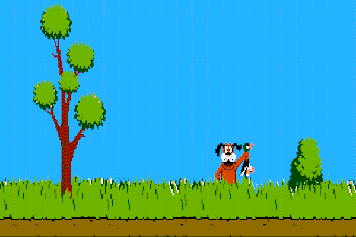
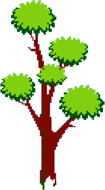
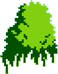
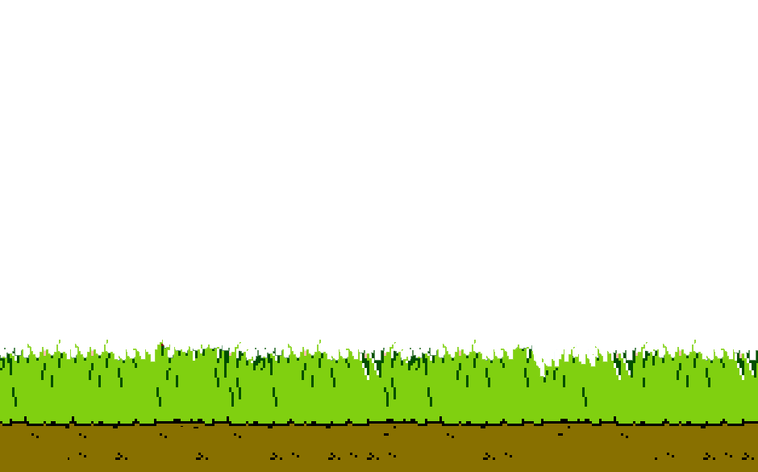

# Unity3D: Nintentdo(R) Duck Hunt "clone"

A one shot "clone" of NES Duck Hunt made in Unity3D. Is not properly a clone... because is only a one-shot duck and restart.

###GAMEPLAY
  
>THIS GIF IS SLOW... GAMEPLAY IS NORMAL

It's a very simple demo, nothing complex, only a touch/click detector on duck that move on pseudo-random position.
The dog appears at the X position of the duck when shooted.

###Requirements
Sample images, download:

> Background image  

> Tree image  

> Plant image  

> Herbs image  

I've separated these images to permit to duck to hide behind tree, plant and terrain.

> This is the players 2D Sprite:  

###Code
There is only one C# script attacched to the duck. Make the duck move, animate the dog and detect shoots.

In particular I've used `InvokeRepeating` for animations, `Random.Range` to retrieve some random value and `Translate` to move the player.

###Todo
everything.